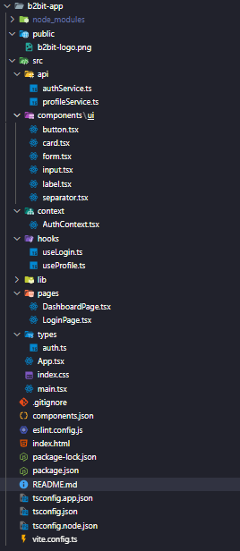

# Aplicação web de autenticação de usuário - b2bit challenge

### Link do projeto: (https://b2bit-app-iota.vercel.app/)

## Passo a passo da aplicação

### 1º Verifique a estrutura de pastas


### 2º Instale as dependências 
* npm install react-router-dom axios @tanstack/react-query.
* npm install react-hook-form @hookform/resolvers zod.
* npx shadcn@latest add form card input button label separator form

### 3º Rode a aplicação
* Utilize o comando ```npm run dev```.
* Acesse o localhost.
* Digite um email e senha válidos para testar a requisição de POST e GET ao entrar no perfil do usuário. 
* Email válido: cliente@youdrive.com 
* Senha válida: password
